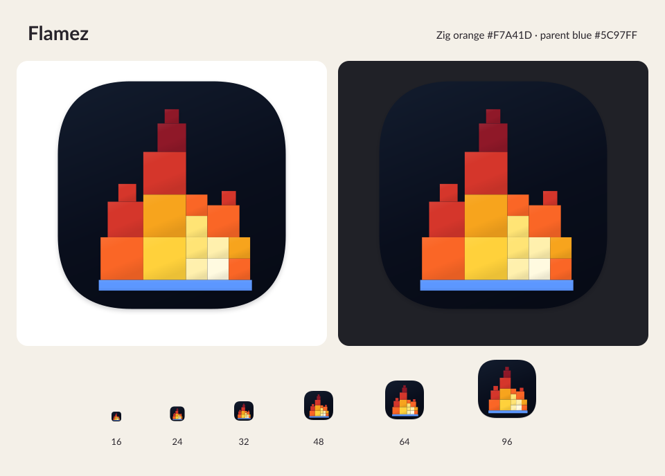

# Flamez icon

A softly lit fire assembled from eighteen square tiles in eight discrete warm colors.
It rests on a blue bar matching the app's parent-node color (`theme.blue`,
`#5C97FF`). The bar extends four artwork units beyond each side of the flame as
an optical correction, retaining its 24-unit height and gapless top edge.
Fourteen 24-unit squares and twelve 4-unit squares form a single fill, keeping
the bar seamless with the same edge antialiasing as the flame.
The navy background is based on Flamez's canvas color (`#090E1C`) from
[`src/theme.zig`](../../src/theme.zig), with the same rounded-square shape and
padding as Zimbr. A faint shadow extends into the transparent margin.

Every flame tile is an axis-aligned square with equal width and height. Large
squares form the body; smaller squares shape the centered tip, uneven side
tongues, and hot core. The squares are 32–96 artwork units wide and meet edge to
edge without gaps, with a shared flat base. The whole assembly is scaled to
87.5% to leave room inside the background. All tile edges align to whole pixels
at 512 and 1024 pixels. Two squares retain exact Zig orange (`#F7A41D`) in their
centers, and the blue bar retains exact parent-node blue through its center.

The squares have gentle upper-left lighting: highlights mix in 6% white, the
centers keep the original colors, and the lower edges darken by 8%. The blue bar
shares the restrained lighting, and the assembled foreground casts one soft
shadow. It uses the same four-unit blur, four-unit downward offset, and 18%
opacity as the background shadow, inspired by Zimbr.

The background has no border: gentle diagonal shading runs from `#111A2B` through
the canvas navy to `#070B16`. Antialiasing softens pixel edges on export.

- Editable master: [`../linux/flamez.svg`](../linux/flamez.svg).
- PNG exports: `flamez-{size}.png`, from 16 to 1024 pixels.
- macOS: [`../macos/flamez.icns`](../macos/flamez.icns), with standard and Retina
  representations from 16 to 1024 pixels.

Regenerate all exports and this preview with `python3 tools/render_icons.py`.
It requires `rsvg-convert` from librsvg. Application builds use the checked-in
exports and do not need an image renderer.

## Platform integration

The layout follows `../zimbr`: one master, Linux desktop identity and hicolor
icons, plus an ICNS container of lossless PNG representations.

On Linux, `zig build` stages `share/applications/flamez.desktop` and SVG/PNG
icons under `share/icons/hicolor`. The desktop filename, `Icon`, `StartupWMClass`,
and SDL app ID all use `flamez`, allowing KDE/Wayland to associate terminal-started
windows with the installed icon. `build.sh` installs these files and refreshes
available desktop caches; `release.sh` includes them in AUR recipes. `NoDisplay`
keeps the entry out of application menus because Flamez needs a target command
or an imported trace. Install under an XDG data prefix such as `/usr/local`
or add a custom prefix's `share` directory to `XDG_DATA_DIRS`.

The executable embeds the 512-pixel PNG and calls `SDL_SetWindowIcon` after window
creation, including for X11 and terminal-started macOS sessions. SDL's
[Cocoa implementation](https://github.com/libsdl-org/SDL/blob/main/src/video/cocoa/SDL_cocoawindow.m)
sets the application's Dock icon. The PNG needs no runtime filesystem lookup.
Unsupported window-icon protocols are nonfatal; Wayland can use the installed
desktop identity instead. SDL documents the app-ID matching behavior
[here](https://wiki.libsdl.org/SDL3/SDL_HINT_APP_ID).

Flamez currently ships a command-line executable rather than a `.app` bundle.
macOS builds install `share/flamez/flamez.icns`, which also travels in the release
archive and Homebrew `share` directory. A future bundle can copy it into
`Contents/Resources` and set `CFBundleIconFile` to `flamez.icns`, as Zimbr does.
The running Dock icon already works through SDL without that bundle.

## Artwork provenance

The initial concept used the built-in image generation tool with
[`prompt.txt`](prompt.txt). The production SVG translates that concept into
eighteen flame squares in eight base colors, including exact Zig orange,
with square tiles in parent-node blue forming the base bar.
All PNG and ICNS exports come from that SVG.
